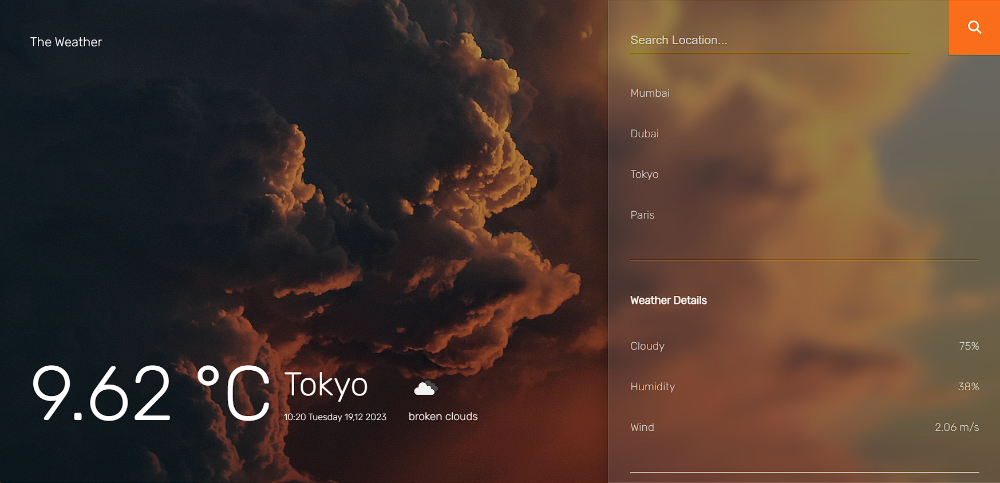

# Weather-App
## Overview

Weather App is a simple web application that provides current weather information for different cities. Users can view temperature, weather conditions, and additional details by selecting a city from the panel or searching for a specific location.

## Features

- **Current Temperature:** Displayed in degrees Celsius.
- **Weather Condition:** Descriptive information about the current weather.
- **City Selection:** Choose from predefined cities or input a custom city name.
- **Background Images:** Dynamically changes based on weather conditions.
- **Additional Details:** Cloud coverage, humidity, and wind speed.

### Sample-Image

<b>Created by aman kumar</b>

